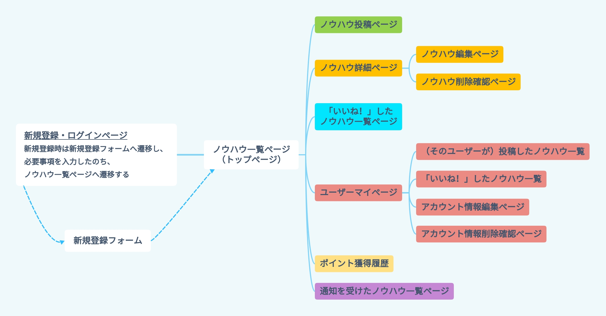

# アプリケーション名
Howto_Share（ハウトゥシェア）

# アプリケーション概要
- 特定の社内間、部署間でノウハウを共有し、業務効率の向上を図ります。
- ノウハウ共有によりシェアポイントが貯まり、第三者からの評価を容易にします。

# URL
デプロイ完了後、記載予定です。

# テスト用アカウント
- メールアドレス1 : abc@test.com
- パスワード1 : abc123
----------------------------------
- メールアドレス2 : def@test.com
- パスワード2 : def456 

# 利用方法
## 【ノウハウ投稿】
1. 新規登録・ログインページからログインします。
2. ヘッダーに「新規投稿」ボタンから、必要事項（タイトル、説明文、画像）を入力します。
3. 入力後、「Share!」ボタンを押します。

## 【ノウハウへのコメント、「いいね！」の実施】
1. 見たいノウハウを一覧ページからアクセスし詳細ページへ遷移します。
2. 「コメントする」ボタンを押します。
3. コメント文（必須）と画像（任意、最大2枚）を入力し、「完了」ボタンを押します。
4. 「いいね！」につきましては、各ノウハウ下部の「いいね！マーク（ハートマーク）」を1クリックします。

## 【シェアポイント制度について】
1. ノウハウの発信者に対して、コメントや「いいね！」がなされると、シェアポイント（SP）が付与されます。
2. 獲得シェアポイントは、ヘッダーと各ユーザーのマイページにて確認できます。

# アプリケーションの作成背景
社内や部署間において、業務や作業のノウハウは社内メールで共有されていたため、
その情報が埋もれてしまい、いつ共有されていたか分からなくなってしまうことが多々ありました。
そのため確認したいときにすぐに確認することができず、業務や作業の遂行に時間がかかっていました。

また、社内における個人の年間目標設定を行う上で、目標内容が曖昧になりがちな部署もあるため、
ノウハウや経験値が豊富でも第三者からの評価を得にくくなっていました。

この2点を同時に解決するべく、各個人が持っているノウハウや経験値を文章や画像で共有することで、
発信者へポイント付与し、第三者からの評価（「いいね！」やコメント）を得やすくします。
加えて、前向きに仕事に励む社員を少しでも増加させ社内の活気や向上を図るとともに、
1つの場所にノウハウや経験値を集めることで、必要な情報を集めやすくし業務効率の向上を図ることも可能となります。

# 洗い出した要件
[要件定義シート](https://docs.google.com/spreadsheets/d/1xUjdQ8EaBr7eOLpKaEtMQLEAaLrW8qkXFrdcV5wBG-8/edit#gid=982722306)

# 実装した機能についての画像やGIFおよびその説明
今後、記載予定です。

# 実装予定の機能
まず、必須項目（要件定義シートの優先度3となっているもの）から実装予定です。
その後、優先度の低い機能も実装し、完成度の高いアプリケーションを実装予定です。

# データベース設計

## USERS TABLE
| Column             | Type   | Options                   |
| ------------------ | ------ | ------------------------- |
| last_name          | string | null: false               |
| fast_name          | string | null: false               |
| email              | string | null: false, unique: true |
| encrypted_password | string | null: false               |
| birthday           | date   | null: false               |
| department         | string |                           |
| message            | text   |

### ASSOCIATION
- has_one_attached :image （imageはActiveStorageでの実装のため、テーブルに含みません）
- has_many :knowhows
- has_many :comments
- has_many :goods
- has_one :points

<!-- --------------------------------------------------------->

## KNOWHOWS TABLE
| Column | Type       | Options                        |
| ------ | ---------- | ------------------------------ |
| title  | string     | null: false                    |
| text   | text       | null: false                    |
| user   | references | null: false, foreign_key: true |

### ASSOCIATION
- belongs_to :user
- has_many :comments
- has_many :goods
- has_one :points

- has_many_attached :images（imagesはActiveStorageでの実装のため、テーブルに含みません）

<!-- --------------------------------------------------------->

## COMMENTS TABLE
| Column  | Type       | Options                        |
| ------- | ---------- | ------------------------------ |
| text    | text       | null: false                    |
| user    | references | null: false, foreign_key: true |
| knowhow | references | null: false, foreign_key: true |

### ASSOCIATION
- belongs_to :user
- belongs_to :knowhow
- has_one :points

- has_many_attached :images（imagesはActiveStorageでの実装のため、テーブルに含みません）

<!-- --------------------------------------------------------->

## GOODS TABLE
| Column  | Type       | Options                        |
| ------- | ---------- | ------------------------------ |
| user    | references | null: false, foreign_key: true |
| knowhow | references | null: false, foreign_key: true |

### ASSOCIATION
- belongs_to :user
- belongs_to :knowhow
- has_one :points

<!-- ------------------------------------------------------- -->

## POINTS TABLE
| Column  | Type       | Options                        |
| ------- | ---------- | ------------------------------ |
| user    | references | null: false, foreign_key: true |
| knowhow | references | null: false, foreign_key: true |
| comment | references | null: false, foreign_key: true |
| good    | references | null: false, foreign_key: true |

### ASSOCIATION
- belongs_to :user
- belongs_to :knowhow
- belongs_to :comment
- belongs_to :good

<!-- --------------------------------------------------------->

# 画面遷移図

# 開発環境
- HTML / CSS
- Ruby / Ruby on Rails
- javaScript
- MySQL
- AWS (S3 / EC2)
- Git / GitHub
- VS Code
- GitMind

# ローカルでの動作方法
% git clone https://github.com/Ninoyanen/Howto_Share.git 
% cd Howto_Share 

# 工夫したポイント
- シェアポイント制度においてランキング上位5人を上半期・下半期・年間総合で表示させて
第三者からの評価をより得やすくしています。
- アプリケーションのロゴはAIを用いて作成しております。

# 改善点
- ノウハウやコメントの文章の内容に対して、適切なものであるかどうか自動で判断できるようにすることです。
  
  （AIを導入した対応策を検討しています。）
-  特定の社内間、部署間で閲覧やコメントができる範囲を制限し、情報セキュリティ上の問題をクリアすることです。

# 制作時間
約220時間（予定）